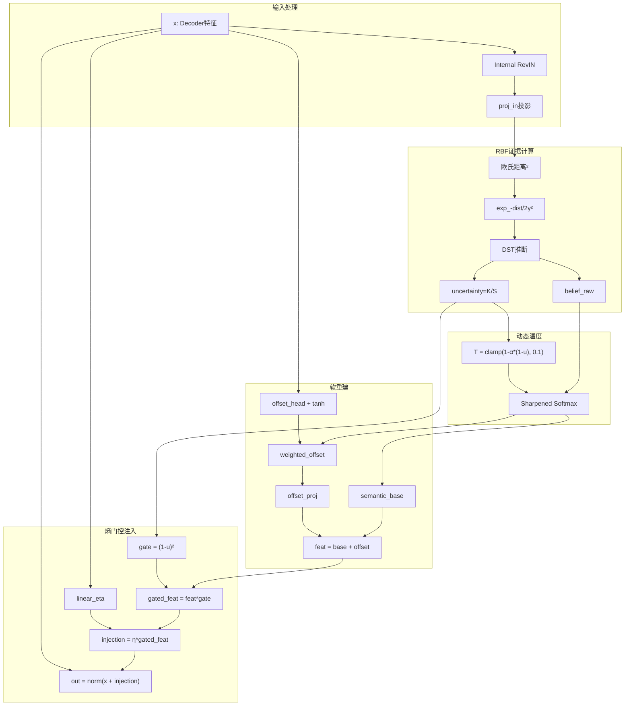

# SP-DEFI+ 重构实施计划

## 架构概览




---

## 1. dft_layer.py - 完全重写

**文件**: [models/dft_layer.py](models/dft_layer.py)

### 核心变更

- **移除**: `pred_len` 条件判断、硬阈值 `hard_threshold`、基于 `pred_len <= 96` 的 Hard/Soft 模式切换
- **新增**: `offset_head`、`offset_proj`、动态温度计算、熵门控

### 关键参数

```python
# 保留
self.centroids_fine = nn.Parameter(torch.randn(num_classes_fine, d_proj))
self.gamma = nn.Parameter(torch.tensor(rbf_gamma))
self.proj_in = nn.Linear(d_model, d_proj)
self.linear_eta = nn.Linear(d_model, d_model)
self.semantic_map = nn.Linear(num_classes_fine, d_model, bias=False)

# 新增
self.offset_head = nn.Linear(d_model, num_classes_fine)  # -> [K] scalars
self.offset_proj = nn.Linear(1, d_model)  # scalar -> d_model
self.alpha_temp = nn.Parameter(torch.tensor(0.5))  # 温度调节因子

# [重要] 锚点均值 buffer (由 init_defi_centroids_sorted 初始化)
self.register_buffer('anchor_means', torch.zeros(num_classes_fine))
```

### 初始化策略 (重要 - 防止 Loss Spike)

**目标**：使 SP-DEFI+ 模块在初始状态下接近"透明"，避免训练初期 injection 产生大随机噪声。

```python
# 在 __init__ 末尾添加

# 1. offset_head 零初始化：初始偏移量为 0
nn.init.zeros_(self.offset_head.weight)
nn.init.zeros_(self.offset_head.bias)

# 2. linear_eta 小增益初始化：减少趋势提取的初始幅度
nn.init.xavier_uniform_(self.linear_eta.weight, gain=0.01)
nn.init.zeros_(self.linear_eta.bias)

# 3. semantic_map 小增益初始化：减少语义原型的初始幅度
nn.init.xavier_uniform_(self.semantic_map.weight, gain=0.01)
```

**原理**：`gain=0.01` 使初始权重极小，injection ≈ 0，模型先用 Backbone 学习，再逐步引入 SP-DEFI+ 增强。

### Forward 流程 (5 步)

- **Step A**: Internal RevIN + Projection
  - 保存 `rev_mean`, `rev_std` 供外部 Loss 使用
- **Step B**: RBF Evidence (无 Softmax) + DST 计算 `uncertainty = K/S`
- **Step C**: Dynamic Temperature `T = clamp(1 - α*(1-u), min=0.1)` + Sharpened Weights
- **Step D**: Soft Reconstruction `feat = semantic_base + offset_proj(weighted_offset)`
- **Step E**: Entropy Gate + Injection (**门控统一表述**)
  ```python
  gate = (1.0 - uncertainty) ** 2  # 使用 Step B 的 uncertainty
  gated_feat = feat * gate         # Gate 先作用于特征
  injection = eta * gated_feat     # 再调制到载波
  out = norm(x + injection)        # 等价于 x + (injection * gate)
  ```

### 返回值变更

```python
# 旧: return out, belief_fine, belief_coarse
# 新: return out, belief_fine_raw, belief_coarse, raw_offsets, (rev_mean, rev_std)
# 
# 说明:
# - belief_fine_raw: Step B 的原始 belief (未 sharpen)，用于 Loss
# - raw_offsets: tanh 后的偏移预测 [B, L, K]
# - (rev_mean, rev_std): Internal RevIN 的统计量，确保 Loss 归一化对齐
```

---

## 2. data_loader.py - Bug 修复 + 新增方法

**文件**: [data_provider/data_loader.py](data_provider/data_loader.py)

### Bug 修复: Dataset_Custom.train_only 逻辑

**当前问题 (第214-218行)**:

```python
num_train = int(len(df_raw) * (0.7 if not self.train_only else 1))
num_test = int(len(df_raw) * 0.2)
num_vali = len(df_raw) - num_train - num_test  # 当 train_only=True 时变为负数!
```

**修复方案**:

```python
if self.train_only:
    num_train = len(df_raw)
    num_vali = 0
    num_test = 0
else:
    num_train = int(len(df_raw) * 0.7)
    num_test = int(len(df_raw) * 0.2)
    num_vali = len(df_raw) - num_train - num_test
```

### 新增方法: get_sample_data()

为所有 Dataset 类添加:

```python
def get_sample_data(self, size=1000):
    """返回随机采样的 (seq_x, seq_y) 用于 K-Means 初始化"""
    indices = np.random.choice(len(self), min(size, len(self)), replace=False)
    seq_x_list, seq_y_list = [], []
    for idx in indices:
        seq_x, seq_y, _, _ = self[idx]
        seq_x_list.append(seq_x)
        seq_y_list.append(seq_y)
    return np.stack(seq_x_list), np.stack(seq_y_list)
```

---

## 3. Informer.py - 集成 SP-DEFI+

**文件**: [models/Informer.py](models/Informer.py)

### 变更点

- **Forward 调用**: 移除 `pred_len` 参数，接收 rev_stats
  ```python
  # 旧: enhanced_feat, b_fine, b_coarse = self.defi_layer(dec_feat, self.pred_len)
  # 新: enhanced_feat, b_fine, b_coarse, offsets, rev_stats = self.defi_layer(dec_feat)
  ```
- **返回值**: 训练时返回 5 个值 (包含 rev_stats 供 Loss 使用)
  ```python
  if self.training:
      return output, b_fine, b_coarse, offsets, rev_stats
  else:
      return output
  ```

---

## 4. exp_main.py - 损失函数与初始化

**文件**: [exp/exp_main.py](exp/exp_main.py)

### A. 初始化函数更新 (init_defi_centroids_sorted) [关键修复]

当前实现基本正确，需确保:

- 使用 `get_sample_data()` 替代遍历 loader
- 排序逻辑: Index 0 = Valley (最低 Y), Index K-1 = Peak (最高 Y)
- **[新增] 保存 anchor_means buffer**：将每个聚类的 Y 值均值保存为模型 buffer

```python
def cluster_and_sort(num_clusters, target_param, anchor_buffer):
    kmeans = KMeans(n_clusters=num_clusters, n_init=10).fit(all_proj)
    centers = kmeans.cluster_centers_
    labels = kmeans.labels_
    
    # 计算每个 Cluster 对应的 Y 均值
    cluster_means = [all_vals[labels == k].mean() if (labels == k).sum() > 0 else 0 
                     for k in range(num_clusters)]
    
    # 按均值从小到大排序
    sort_idx = np.argsort(cluster_means)
    sorted_means = np.array(cluster_means)[sort_idx]  # [新增]
    
    # 保存到模型
    target_param.data = torch.tensor(centers[sort_idx]).float().to(device)
    anchor_buffer.data = torch.tensor(sorted_means).float().to(device)  # [新增]

# 调用
cluster_and_sort(
    model_ref.defi_layer.num_classes_fine, 
    model_ref.defi_layer.centroids_fine,
    model_ref.defi_layer.anchor_means  # [新增]
)
```

### B. 新损失函数 (calc_sp_defi_loss) [关键修复]

**修复点**:
1. 使用真实聚类均值 `anchor_means` 而非 `linspace`
2. 归一化方式与 `dft_layer` 保持一致（使用 dft_layer 返回的 rev_stats）

```python
def calc_sp_defi_loss(self, belief_f, raw_offsets, true_y, rev_stats=None):
    """
    SP-DEFI+ 辅助损失
    
    Args:
        belief_f: [B, L, K] 原始 belief (未 sharpen)
        raw_offsets: [B, L, K] tanh 后的偏移预测
        true_y: [B, L, D] 真实标签
        rev_stats: (rev_mean, rev_std) 来自 dft_layer 的归一化统计量
    """
    model_ref = self.model.module if isinstance(self.model, nn.DataParallel) else self.model
    valid_len = min(96, self.args.pred_len)
    
    # 1. Myopic Mask: 只监督 t <= 96
    if valid_len <= 0:
        return torch.tensor(0.0, device=true_y.device)
    
    belief_f = belief_f[:, :valid_len, :]
    raw_offsets = raw_offsets[:, :valid_len, :]
    true_y_crop = true_y[:, :valid_len, :]
    
    # 2. [修复] 使用与 dft_layer 一致的归一化
    # 注意: rev_mean/rev_std 形状为 [B, 1, D] (keepdim=True)，需要正确处理广播
    if rev_stats is not None:
        rev_mean, rev_std = rev_stats
        # [关键] 只有当时间维度 > 1 时才切片，否则视为全局统计量进行广播
        # rev_mean 形状通常是 [B, 1, D]，不需要切片
        if rev_mean.dim() == 3 and rev_mean.shape[1] > 1:
            rev_mean = rev_mean[:, :valid_len, :]
        if rev_std.dim() == 3 and rev_std.shape[1] > 1:
            rev_std = rev_std[:, :valid_len, :]
        # 广播机制会自动处理 [B, 1, D] 与 [B, L, D] 的对齐
        y_norm = (true_y_crop - rev_mean) / (rev_std + 1e-5)
    else:
        y_norm = (true_y_crop - true_y_crop.mean(dim=1, keepdim=True)) / (true_y_crop.std(dim=1, keepdim=True) + 1e-5)
    
    # 3. [修复] 使用真实聚类均值作为锚点，而非 linspace
    anchors = model_ref.defi_layer.anchor_means  # [K] 真实的排序后聚类均值
    
    # 4. 动态软目标生成 (基于 anchor 距离)
    y_scalar = y_norm.mean(dim=-1, keepdim=True)  # [B, L, 1]
    dist_sq = (y_scalar - anchors.view(1, 1, -1)) ** 2  # [B, L, K]
    q = F.softmax(-dist_sq / (2 * self.args.rbf_gamma ** 2), dim=-1)  # Gaussian soft target
    
    # 5. KL 散度分类损失
    loss_cls = F.kl_div(torch.log(belief_f + 1e-8), q, reduction='batchmean')
    
    # 6. 软回归损失 (Weighted MSE)
    true_offset = y_scalar - anchors.view(1, 1, -1)  # [B, L, K]
    loss_reg = (q * (raw_offsets - true_offset) ** 2).sum(dim=-1).mean()
    
    return self.args.lambda_cls * loss_cls + self.args.lambda_reg * loss_reg
```

### C. 训练循环更新

**[重要] 数据加载器拆包必须为 4 个值**：

```python
# 必须确保是 4 个值，否则必崩!
for i, (batch_x, batch_y, batch_x_mark, batch_y_mark) in enumerate(train_loader):
```

**模型调用与 Loss 计算**：

```python
# 旧: outputs, b_fine, b_coarse = self.model(...)
# 新: outputs, b_fine, b_coarse, offsets, rev_stats = self.model(...)

# MSE 损失
loss_mse = criterion(outputs, batch_y_cropped)

# SP-DEFI+ 辅助损失 (传入 rev_stats 确保归一化对齐)
loss_aux = self.calc_sp_defi_loss(b_fine, offsets, batch_y_cropped, rev_stats)
loss = loss_mse + loss_aux
```

**注意**: Informer.py 的返回值需要相应更新为 5 个值 (包含 rev_stats)。

---

## 5. 红队检查清单 (必须验证)

### 核心逻辑
- **熵源**: `uncertainty` 和 `gate` 必须使用 Step B 的 `belief_raw`，不能用 Step C 的 sharpened weights → `dft_layer.py forward`
- **Offset 边界**: `offset_head` 输出必须包裹 `torch.tanh()` → `dft_layer.py Step D`
- **门控位置**: Gate 先作用于 feat，即 `gated_feat = feat * gate`，然后 `injection = eta * gated_feat` → `dft_layer.py Step E`

### 数据兼容
- **数据加载兼容**: `__getitem__` 返回 4 个值 → `data_loader.py`
- **训练循环拆包**: `for i, (batch_x, batch_y, batch_x_mark, batch_y_mark)` 必须是 4 个值 → `exp_main.py`

### 损失函数
- **锚点来源**: Loss 中使用 `anchor_means` buffer，不使用 `linspace` → `exp_main.py calc_sp_defi_loss`
- **归一化对齐**: Loss 中 y_norm 使用 dft_layer 返回的 rev_stats → `exp_main.py`
- **rev_stats 维度**: 只有当 `rev_mean.shape[1] > 1` 时才切片，否则依赖广播 → `exp_main.py calc_sp_defi_loss`
- **Gamma 一致性**: Loss 使用固定 `args.rbf_gamma=1.0`，模型内部使用可学习 gamma → `run.py`, `dft_layer.py`

### 初始化
- **offset_head 初始化**: 权重初始化为 0 → `dft_layer.py __init__`
- **linear_eta 初始化**: 使用 `xavier_uniform_(gain=0.01)` → `dft_layer.py __init__`
- **semantic_map 初始化**: 使用 `xavier_uniform_(gain=0.01)` → `dft_layer.py __init__`

### 梯度流
- **梯度流**: 若出现循环依赖，对 temperature 中的 uncertainty 使用 `.detach()` → `dft_layer.py Step C`


---

## 6. 新增配置参数 (run.py)

```python
parser.add_argument('--lambda_cls', type=float, default=0.1, help='KL分类损失权重')
parser.add_argument('--lambda_reg', type=float, default=0.05, help='软回归损失权重')
parser.add_argument('--alpha_temp', type=float, default=0.5, help='动态温度调节因子')
```

### Gamma 一致性说明 (重要)

**设计决策**：Loss 中使用固定的 `args.rbf_gamma`，而模型内部使用可学习的 `softplus(self.gamma)`。

**原因**：
- 固定 Gamma 生成的 Soft Target 更稳定（Teacher Forcing）
- 可学习 Gamma 允许模型自适应调整 RBF 宽度

**建议默认值**：`rbf_gamma=1.0`（适中）
- 太小（如 0.1）→ Soft Target 趋近 One-Hot，监督信号尖锐
- 太大（如 5.0）→ Soft Target 趋近均匀分布，监督信号模糊

```python
# run.py 中已有的参数，确保默认值合理
parser.add_argument('--rbf_gamma', type=float, default=1.0, help='RBF kernel width for Loss (fixed)')
```

