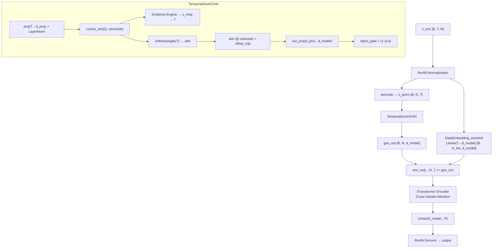

# Temporal GeoHCAN: Time-Space Orthogonal Decoupling for iTransformer

## Why This Should Work (Unlike Previous Approaches)

Previous attempts placed GeoHCAN POST-encoder on variate tokens, where it competed with already-formed encoder representations. The encoder rejected GeoHCAN's contribution (alpha always negative, reliability near 1.0 = no effect).

The temporal approach is fundamentally different:

- GeoHCAN operates PRE-encoder on raw temporal data (its natural domain)
- It adds **new information** the encoder never had (geometric waveform structure)
- Orthogonal division: GeoHCAN handles temporal geometry, encoder handles cross-variate correlations
- Residual design: `enc_out = original_embedding + gated_geo_out` (can only help)

## Architecture




Key design decisions:

- **Sequence-level projection** `Linear(T=96 → d_proj=64)`: each variate's whole waveform is projected to geometric space (not per-timestep with d_model=1, which gives GeoHCAN nothing to work with)
- **Residual addition**: `enc_out = embedding + geo_out` preserves baseline information
- **Only variate tokens**: geo_out is added to the first N tokens (actual variates), not temporal mark tokens (positions N to N_tok-1)
- **Full GeoHCAN mechanism**: reuses the battle-tested dual-track uncertainty, temperature control, offset MLP, and inject gate from [dft_layer.py](models/dft_layer.py)
- **No detach on enc_out**: unlike previous approach, GeoHCAN gets direct MSE gradient (it enriches the input, not corrects the output)

## File Changes

### 1. [models/iTransformer.py](models/iTransformer.py)

**Replace `VariateGeoHCAN` with `TemporalGeoHCAN`:**

- `proj: Linear(seq_len, d_proj)` instead of `Linear(d_model, d_proj)`
- Full reconstruction pipeline: `out_proj: Linear(d_proj, d_model)` + `offset_mlp`
- Dual-track evidence engine (Track A: DST u_std for losses, Track B: u_resp for temperature)
- `inject_gate = (1 - u_resp) ** gate_power` for uncertainty-gated contribution
- Returns 7-tuple `(geo_out, u_std, T_mean, attn, ortho_loss, geo_loss, latent_loss)` for compatibility
- Parameter overhead: ~~48K (~~1% of total model)

**Rewrite `Backbone`:**

- Replace `self.geo_hcan = VariateGeoHCAN(d_model=512, ...)` with `self.geo_hcan = TemporalGeoHCAN(seq_len=96, d_model=512, ...)`
- In forward: add GeoHCAN output to embedding BEFORE encoder (not after)
- Handle N vs N_tok dimension mismatch (geo_out has N=7 dims, enc_out has N_tok=11)
- Remove `.detach()` on encoder output (no longer needed, GeoHCAN operates on raw input)
- Remove `no_isolation` flag (no longer relevant)

### 2. [exp/exp_main.py](exp/exp_main.py)

**Simplify `init_geo_centroids`:**

- No longer needs to run the encoder to get features
- Just: RevIN normalize → permute to [B, N, T] → proj through `geo_hcan.proj` → K-Means
- Remove the `rel_threshold` / `rel_slope` calibration (no longer used)
- Keep RNG reset after K-Means init

### 3. [run.py](run.py) (minor)

- Remove `--no_isolation` argument (no longer relevant)
- No new arguments needed (existing `--d_proj`, `--num_fine`, `--gate_power`, `--detach_temp`, `--use_proj_ln` all still apply)

## K-Means Initialization

The centroids now represent **temporal archetypes** — common waveform patterns in the training data. For each training batch:

1. Apply RevIN normalization (same as Backbone.forward)
2. Permute to `[B, N, T]`
3. Project through `geo_hcan.proj + proj_norm` → `[B, N, d_proj]`
4. Reshape to `[B*N, d_proj]` and collect
5. K-Means finds K=4 temporal archetypes

This is much simpler than the current init (no encoder forward pass needed).

## Recommended Test Command

```bash
python -u run.py \
  --is_training 1 --model_id ETTh1_96_96 --model iTransformer \
  --data ETTh1 --data_path ETTh1.csv --features M \
  --seq_len 96 --label_len 48 --pred_len 96 \
  --enc_in 7 --dec_in 7 --c_out 7 \
  --d_model 512 --d_ff 512 --e_layers 2 --n_heads 8 \
  --dropout 0.1 --activation gelu --batch_size 32 \
  --learning_rate 0.001 --train_epochs 10 --patience 3 --itr 1 \
  --d_proj 64 --num_fine 4 --gate_power 2 \
  --lambda_ortho 0.001 --lambda_latent 0.05 --lambda_geo 0.0
```

Baseline MSE = 0.384. Target: below 0.384.